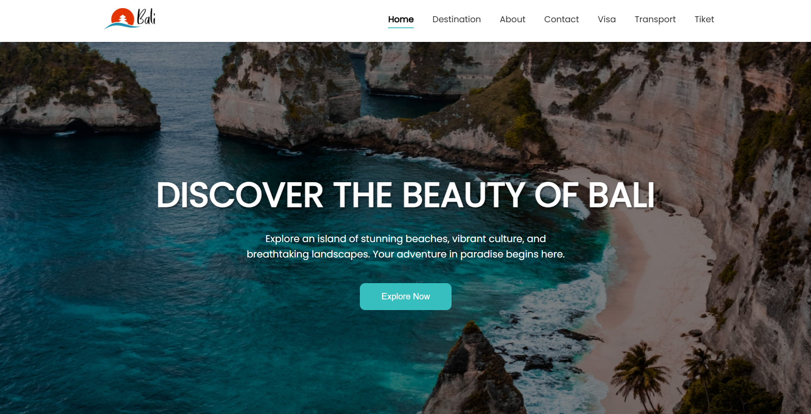

# Bali Tourism Portal - Web Platform

<p align="center">
  
</p>

<p align="center">
  <a href="#--about-the-project">About</a> •
  <a href="#--key-features">Features</a> •
  <a href="#--tech-stack">Tech Stack</a> •
  <a href="#--getting-started">Getting Started</a> •
  <a href="#--project-structure">Structure</a> •
  <a href="#--contributing">Contributing</a> •
  <a href="#--license">License</a>
</p>

<p align="center">
  <!-- Ganti dengan badge yang sesuai -->
  
  
  
  
</p>

---

## - About The Project

This project is a web-based tourism portal for Bali, engineered to serve as a comprehensive guide for travelers. It offers a streamlined user experience for planning and booking trips by consolidating essential information—from top destinations to transportation logistics—into a single, elegantly designed platform. The front-end is built with a responsive, 100vh design paradigm for a seamless, professional-grade user experience on any modern browser.

---

## - Key Features

- **Dynamic Destination Showcase**: Curated list of Bali's premier attractions, rendered dynamically.
- **Visa Information Hub**: Centralized, up-to-date visa guidelines for international visitors.
- **Interactive Flight Search**: A stateful form interface for searching and filtering flight options.
- **Modern UI/UX**: A clean, non-scrollable, full-viewport interface built with modern CSS.
- **Exclusive Flight Recommendations**: Dynamically generated cards showcasing curated flight deals.

---

## - Tech Stack

This project leverages a classic LAMP stack architecture:

- **Backend**: `PHP 7.4+`
- **Frontend**:
  - `HTML5`
  - `CSS3` (Flexbox, Grid Layout)
  - `JavaScript (ES6)`
- **Database**: `MySQL 8.0+`
- **Web Server**: Apache (recommended)

---

## - Getting Started

To get a local copy up and running, follow these steps.

### Prerequisites

Ensure you have a local development environment that supports PHP and MySQL. The following setup is recommended:

- [XAMPP](https://www.apachefriends.org/index.html) or a similar AMP stack (MAMP, WAMP).
- [Git](https://git-scm.com/downloads) for version control.

### Installation

1.  **Clone the Repository**
    ```sh
    git clone https://github.com/qoidrifat/bali-project.git
    cd bali-project
    ```

2.  **Set Up the Database**
    - Start your Apache and MySQL services via the XAMPP Control Panel.
    - Navigate to `http://localhost/phpmyadmin`.
    - Create a new database named `db_pariwisata_bali`.
    - Select the new database and go to the `Import` tab.
    - Upload the `bali.sql` file provided in the root of this project and execute the import.

3.  **Deploy Project Files**
    - Move the entire project folder into the `htdocs` directory of your XAMPP installation.

4.  **Launch the Application**
    - Open your web browser and navigate to:
      **`http://localhost/pariwisataweb/`**

---

## - Project Structure

The project adheres to a standard monolithic PHP application structure:

```
pariwisataweb/
|-- images/           # Static image assets
|-- styles/           # CSS stylesheets
|   |-- global.css
|   |-- navbar.css
|   `-- transport.css
|-- about.php         # Application view
|-- contact.php       # Application view
|-- index.php         # Main entry point
|-- transport.php     # Application view
|-- ...               # Other .php files
|-- bali.sql          # Database schema and data dump
|-- README.md         # This file
```

---

## - Contributing

Contributions are what make the open-source community such an amazing place to learn, inspire, and create. Any contributions you make are **greatly appreciated**.

If you have a suggestion that would make this better, please fork the repo and create a pull request. You can also simply open an issue with the tag "enhancement".

1.  Fork the Project
2.  Create your Feature Branch (`git checkout -b feature/AmazingFeature`)
3.  Commit your Changes (`git commit -m 'Add some AmazingFeature'`)
4.  Push to the Branch (`git push origin feature/AmazingFeature`)
5.  Open a Pull Request

---

## - License

Distributed under the MIT License. See `LICENSE` file for more information.
