<p align="center">
  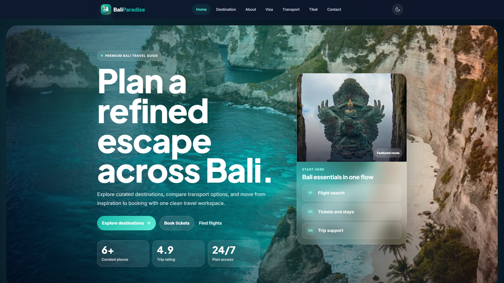
</p>

<h1 align="center">Bali Project</h1>

<p align="center">
  A native PHP tourism portal for exploring Bali — destinations, transport, tickets, accommodation, and an internal booking flow with invoices.
</p>

<p align="center">
  
  
  
  
  
  
  
</p>

<p align="center">
  <a href="#overview">Overview</a> •
  <a href="#features">Features</a> •
  <a href="#technology-stack">Tech Stack</a> •
  <a href="#architecture">Architecture</a> •
  <a href="#screenshots">Screenshots</a> •
  <a href="#getting-started">Getting Started</a> •
  <a href="#roadmap">Roadmap</a>
</p>

---

## Overview

**Bali Project** is a production-oriented, native PHP tourism website that moves a traveler from *inspiration to itinerary* in one place. Visitors can research destinations, check visa guidance, compare flight/bus routes, book hotels and car rentals, and complete an internal booking flow backed by HTML invoices.

It is built for three audiences:

| Audience | What they get |
|---|---|
| **Travelers** | A clean, fast portal to plan a Bali trip end-to-end |
| **Developers** | A readable, framework-free PHP codebase with shared partials, helpers, and a design-token CSS system |
| **Administrators** | A role-protected dashboard to manage destinations, bookings, invoices, payments, and content |

The project deliberately avoids frameworks and build tools: **no Composer, no npm, no Laravel**. It runs on any Apache/PHP/MySQL stack (Laragon, XAMPP, or shared hosting) with minimal setup.

---

## Features

| Area | Feature | Benefit |
|---|---|---|
| 🏝️ Tourism | Destination listing from the database | Fresh content managed by admins |
| 🏝️ Tourism | Detail pages with reviews & ratings | Social proof helps travelers choose |
| 🛂 Travel planner | Visa information hub | Step-by-step entry guidance |
| ✈️ Transport | Flight search & results | Compare routes without leaving the site |
| 🚌 Transport | Bus ticket search & results | Same flow for bus operators |
| 🏨 Accommodation | Hotel booking search | Matches stays to dates and guests |
| 🚗 Accommodation | Car rental search | Extends the trip to ground transport |
| 📝 Booking | Internal booking + confirmation | Complete a trip and receive an invoice |
| 🧾 Booking | HTML invoice & history | Records kept per account |
| 🔐 Authentication | Register / login / logout | Sessions with password hashing & CSRF |
| 🎛️ Dashboard | Role-based admin panel | Destinations, bookings, invoices, payments, users |
| 📊 Reports | Booking/invoice CSV export | Operational data leaves the panel cleanly |
| 🖥️ UI | Responsive light/dark theme | Premium tropical design across devices |
| 🗺️ Location | City-based route matching | Realistic origin/destination data model |

---

## Technology Stack

| Layer | Technology |
|---|---|
| **Backend** | Native PHP 8.2 |
| **Database** | MySQL / MariaDB (driver: `mysqli`) |
| **Frontend** | HTML5, CSS3, Vanilla JavaScript (ES6+) |
| **Styling** | Custom design-system CSS (tokens, base, components) |
| **Security** | `password_hash`, prepared statements, CSRF tokens, security headers |
| **Web server** | Apache (`.htaccess`), Laragon / XAMPP, or PHP built-in server |
| **Dev tools** | PHP CLI, `mysqli`, optional `mysqldump` for backups |
| **Dependencies** | None — no Composer, no npm, no build step |

---

## Architecture

Bali Project uses **file-based routing** on top of a shared layout system. Each PHP file in the web root is a public route; shared partials and helper functions keep the pages consistent and small.

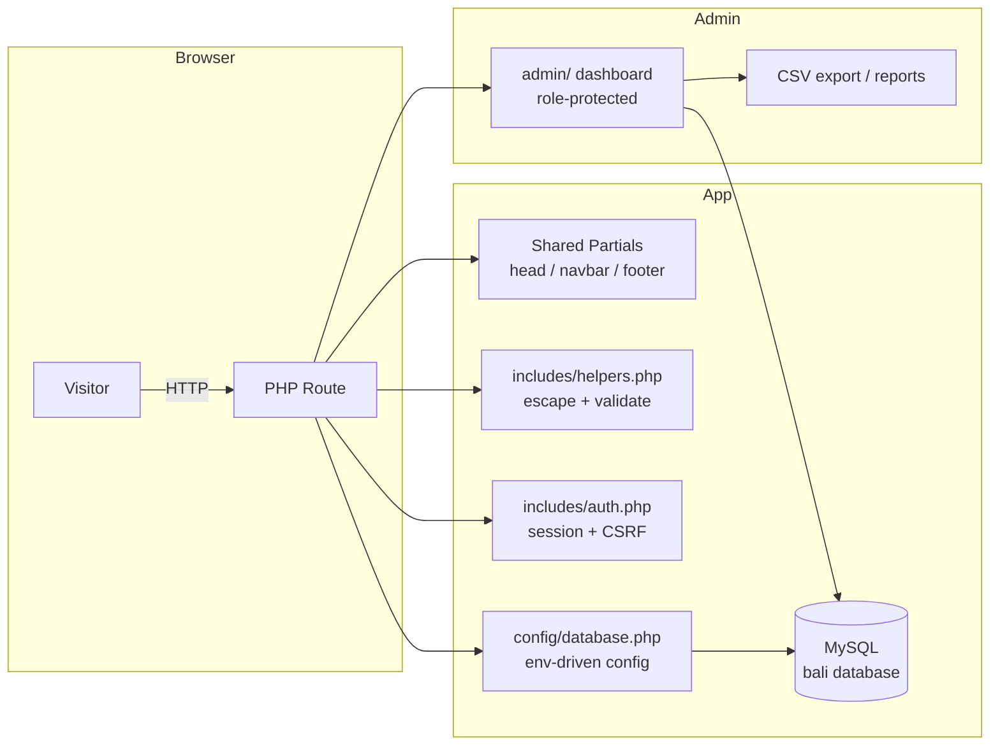
```mermaid
flowchart LR
    subgraph Browser
        A[Visitor] -->|HTTP| B[PHP Route]
    end

    subgraph App
        B --> C[Shared Partials<br/>head / navbar / footer]
        B --> D[includes/helpers.php<br/>escape + validate]
        B --> E[includes/auth.php<br/>session + CSRF]
        B --> F[config/database.php<br/>env-driven config]
        F --> G[(MySQL<br/>bali database)]
    end

    subgraph Admin
        B --> H[admin/ dashboard<br/>role-protected]
        H --> G
        H --> I[CSV export / reports]
    end
```

**Request flow**

```text
Browser
  -> route PHP file (index.php, destination.php, hasil.*.php, …)
  -> includes partials/head.php, partials/navbar.php, partials/footer.php
  -> includes connection.php when database access is needed
  -> mysqli prepared statements
  -> renders HTML directly
```

The `.htaccess` file blocks direct access to internal folders (`config/`, `includes/`, `database/`, `partials/`, `storage/`) and sets cache + security headers for production-safe Apache hosting.

## Project Workflow

A typical visitor journey flows through the public pages while authenticated users unlock the booking and admin layers:

```text
1. Browse homepage & destinations
   → destination.php, detail.php?id=…
2. Research visa & transport options
   → visa.php, transport.php
3. Search tickets, hotels, or car rentals
   → tiket.php, booking.hotel.php, sewa.mobil.php
   → hasil.*.php results with prepared statements
4. Sign in and complete an internal booking
   → register.php / login.php → booking/index.php
   → confirmation + HTML invoice
5. Manage content & operations (admins)
   → admin/index.php → destinations, bookings, invoices, payments
```

---

## Screenshots

> All screenshots are captured from the running application. See `docs/images/`.

| | |
|---|---|
| **Homepage** | **Destination detail** |
|  | 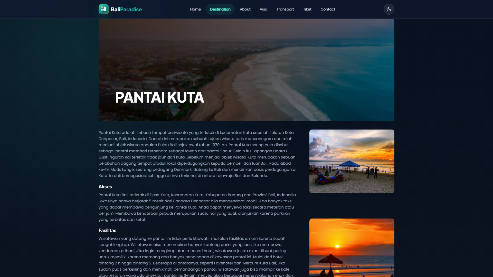 |
| **Destinations** | **Transport search** |
| 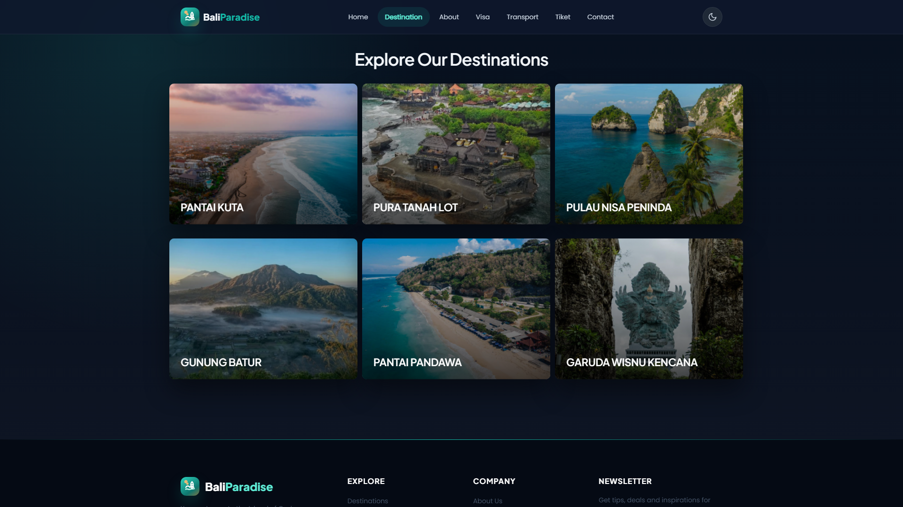 | 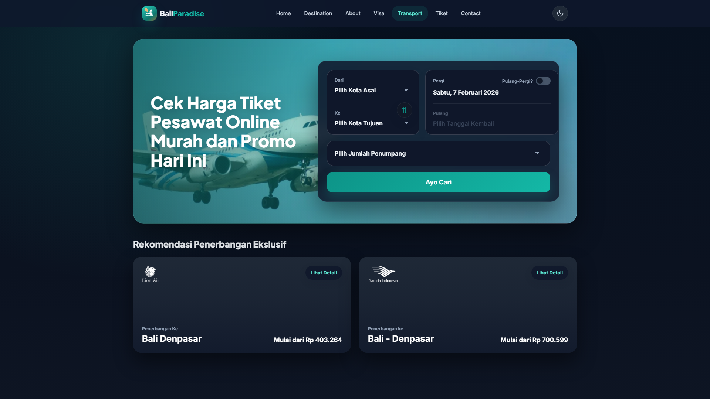 |
| **Ticket & booking menu** | **Internal booking form** |
| 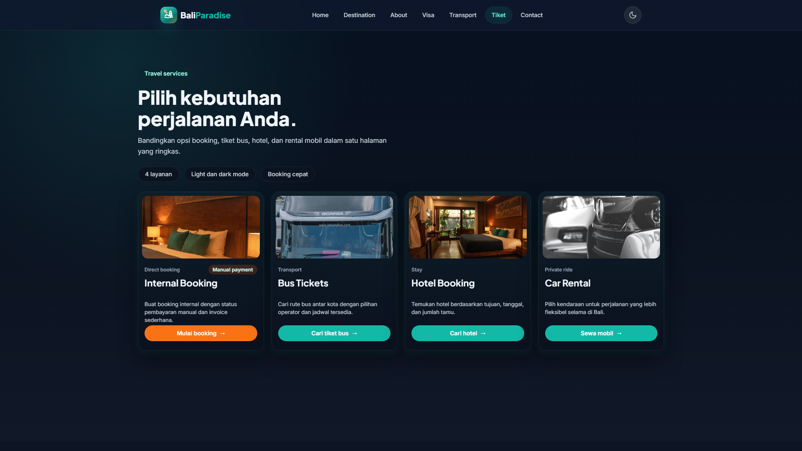 | 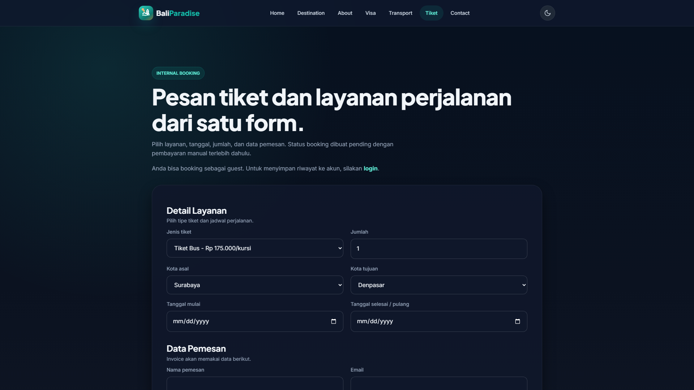 |
| **Admin dashboard** | **Admin gallery** |
| 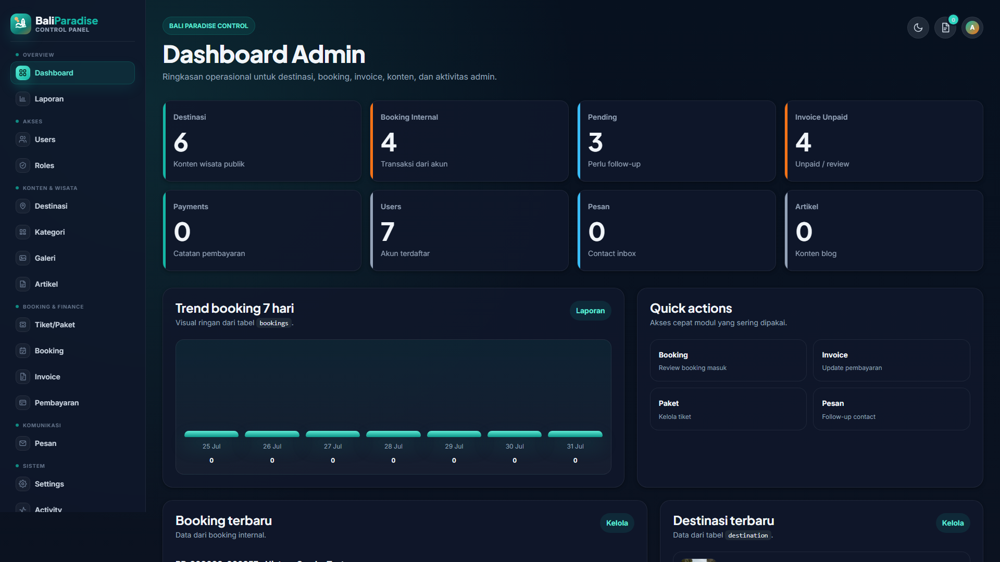 | 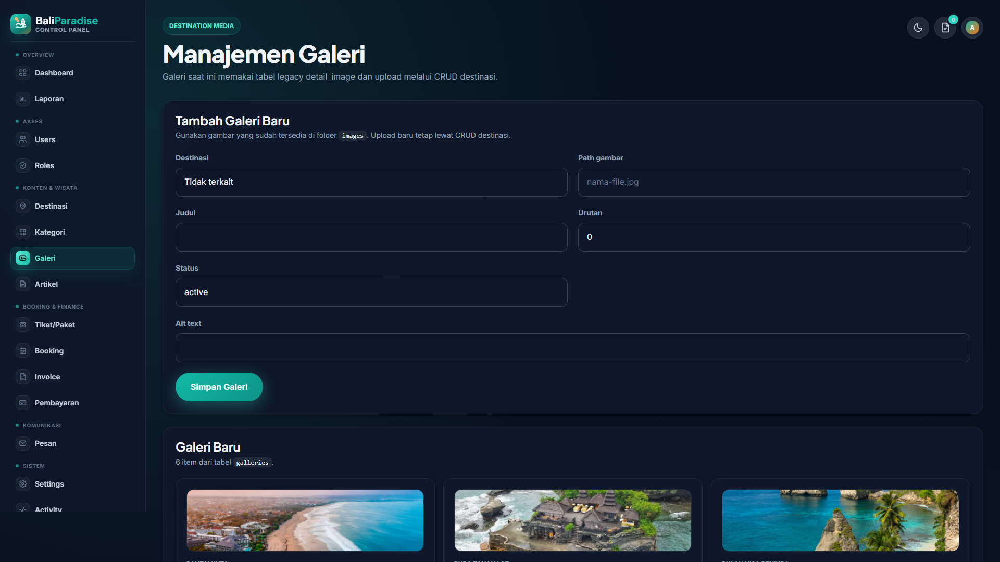 |
| **Authentication** | **Booking form** |
| 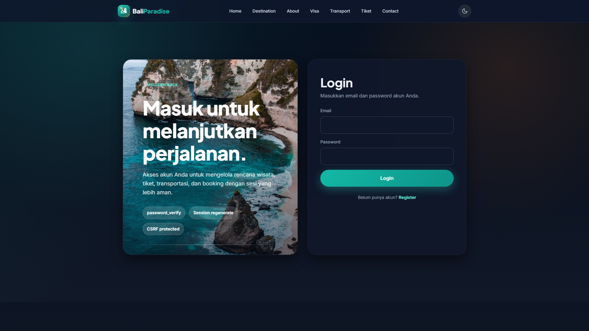 |  |

**Mobile-first responsive layouts**

> Captured at 390×844 (iPhone-class viewport) from the running application.

| | |
|---|---|
| **Home** | **Destinations** |
| 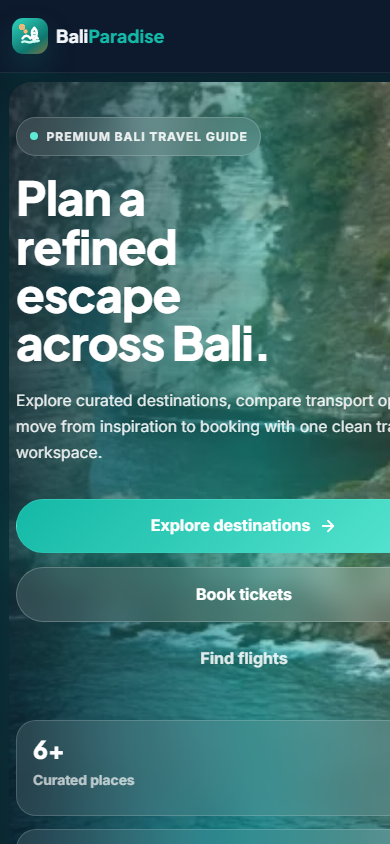 | 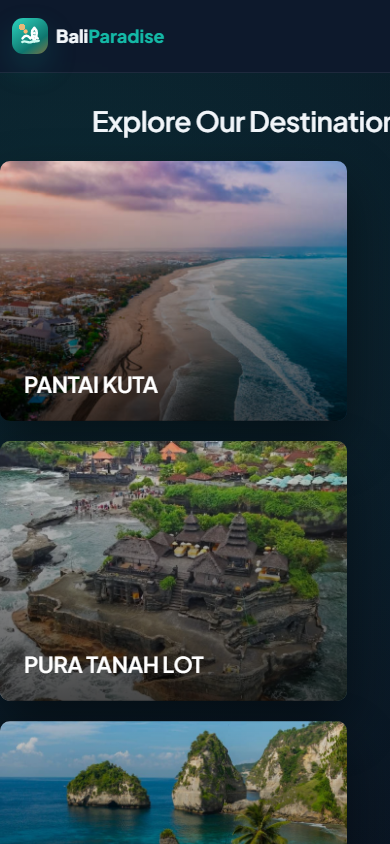 |
| **Destination detail** | **About** |
| 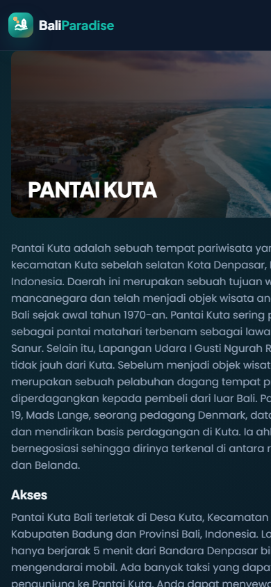 | 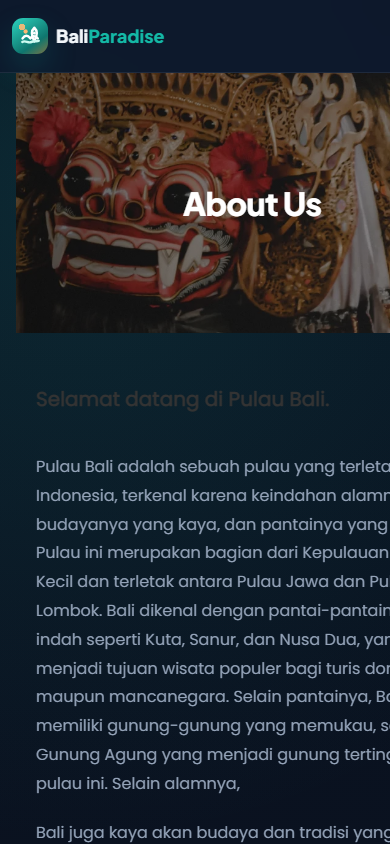 |
| **Visa** | **Transport search** |
| 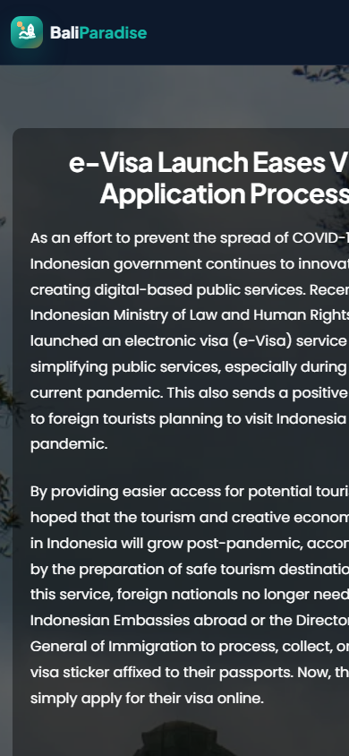 | 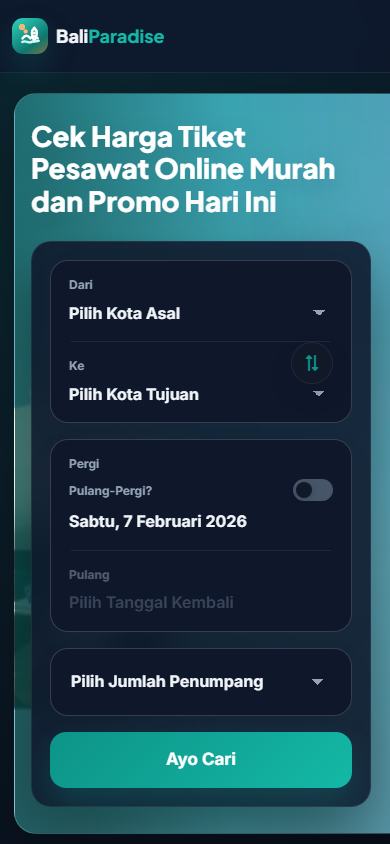 |
| **Ticket & booking menu** | **Authentication** |
| 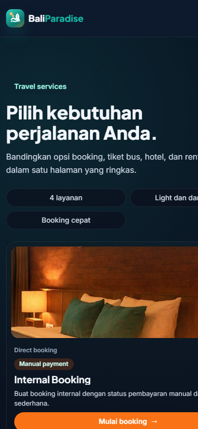 | 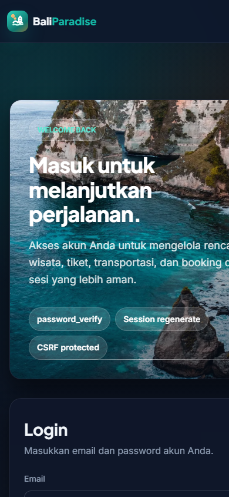 |

---

## Getting Started

### Prerequisites

- PHP **8.x** with the `mysqli` extension
- MySQL or MariaDB
- Apache (Laragon / XAMPP) or the PHP built-in server
- A modern browser

No `composer install` or `npm install` is required.

### 1. Set up the database

Create a database named `bali` and import the canonical dump:

```text
storage/private/database/bali.sql
```

The dump creates the core tables — `destination`, `detail`, `hotel`, `car`, `pesawat`, `buses`, and related booking tables. Optional feature tables (auth, reviews, internal booking, admin content) live as reviewed manual migrations in `database/`.

### 2. Configure the connection

The app reads configuration from environment variables with local fallbacks:

```text
BALI_DB_HOST=localhost
BALI_DB_USER=root
BALI_DB_PASSWORD=
BALI_DB_NAME=bali
```

A secret-free example is provided at `config.example.php`. For production, set the real values in your hosting environment — never in the repository.

### 3. Serve the app

**Laragon / XAMPP (Apache):**

1. Place the project folder under the document root, e.g. `C:\laragon\www\bali-project`.
2. Open `http://localhost/bali-project/`.

**PHP built-in server:**

```sh
php -S 127.0.0.1:8088 -t .
```

Open `http://127.0.0.1:8088/index.php`.

> Note: the PHP built-in server does not read `.htaccess`. Use Apache to test the file-protection rules.

### 4. Enable optional features

| Feature | Migration |
|---|---|
| Auth (roles, users) | `database/2026_06_09_create_auth_tables.sql` |
| User profile fields | `database/2026_06_09_add_user_profile_columns.sql` |
| Internal booking | `database/2026_06_09_create_internal_booking_tables.sql` |
| Destination reviews | `database/2026_06_09_create_reviews_table.sql` |
| Admin content tables | `database/2026_06_09_create_admin_content_tables.sql` |
| Contact messages | `database/2026_06_09_create_contact_messages_table.sql` |
| Admin activity log | `database/2026_06_09_create_admin_activity_logs_table.sql` |

Review each file, back up your database, then run the SQL for the features you need.

### 5. Create an admin account

Register a normal user at `/register.php`, then promote that account by adapting `database/2026_06_09_promote_admin_user.sql`. Alternatively, use the CLI seeder:

```sh
php database/seed_admin_user.php
```

The seeder prints generated credentials once, to the terminal. Use a strong password in production.

---

## Project Structure

```text
bali-project/
├── *.php                  # Public routes (index, destination, detail, hasil.*, …)
├── .htaccess              # Apache protection, security headers, caching
├── config.example.php     # Secret-free configuration example
├── admin/                 # Role-protected admin dashboard & CRUD
├── assets/js/             # Global JavaScript
├── booking/               # Internal booking flow (store, confirmation, invoice)
├── config/                # Database configuration
├── database/              # Reviewed manual SQL migrations + seeder
├── docs/                  # Documentation, reports, screenshots
│   └── images/            # README & documentation screenshots
├── images/                # Original image assets
│   ├── optimized/         # WebP-optimized variants
│   └── uploads/           # Admin-uploaded images
├── includes/              # Helpers: database, auth, escaping, validation
├── partials/              # Shared head, navbar, footer
├── scripts/               # CLI tools (backup, preview renderer)
├── storage/private/       # Protected SQL dump, archive, backups
└── styles/                # Design-token CSS system
```

---

## Database Structure

The `bali` database groups related tables by domain:

| Domain | Tables |
|---|---|
| **Destinations** | `destination`, `detail`, `detail_image`, `destination_categories` |
| **Travel routes** | `from_city`, `to_city`, `destinations` |
| **Flights** | `pesawat`, `bookings_pesawat` |
| **Buses** | `buses`, `routes_bus` |
| **Hotels** | `hotel`, `bookings_hotel` |
| **Cars** | `car`, `bookings_mobil` |
| **Accounts** | `roles`, `users` |
| **Internal booking** | `bookings`, `booking_details`, `payments` |
| **Content** | `articles`, `galleries`, `tickets`, `contact_messages`, `site_settings` |
| **Audit** | `admin_activity_logs` |

All queries in the app use `mysqli` prepared statements on user-supplied input.

---

## Roadmap

### Phase 1 — Stabilization
- [ ] Consolidate all database access through helper functions
- [ ] Remove remaining error suppressions on queries
- [ ] Build a reusable error page component
- [ ] Ensure every POST route uses CSRF

### Phase 2 — Backend structure
- [ ] Extract per-feature query services
- [ ] Standardize route naming and page include patterns
- [ ] Document table and field naming conventions

### Phase 3 — UI/UX polish
- [ ] Finish migrating legacy CSS to design tokens
- [ ] Reduce remaining inline styles
- [ ] Validate mobile layouts across all pages

### Phase 4 — Admin & data
- [ ] Complete CRUD for hotels, transport, buses, and cars
- [ ] Add admin filters, search, and pagination
- [ ] Add safe audit fields (`created_at`, `updated_at`, soft-delete)

### Phase 5 — Production readiness
- [ ] Keep SQL dumps and archives out of the production public root
- [ ] Add final `sitemap.xml` and `robots.txt` after domain is known
- [ ] Add backup & restore process
- [ ] Run a final security and performance review

---

## Documentation

| Document | Purpose |
|---|---|
| [`docs/PROJECT_GUIDE.md`](docs/PROJECT_GUIDE.md) | Full developer guide (setup, structure, routes, security) |
| [`docs/ADMIN_OPERATIONS.md`](docs/ADMIN_OPERATIONS.md) | Admin modules, backups, and exports |
| [`DEPLOYMENT.md`](DEPLOYMENT.md) | Production deployment checklist |
| [`database/README.md`](database/README.md) | Database dump and migration notes |
| [`docs/reports/`](docs/reports/) | Audit, review, and cleanup reports |
| [`CHANGELOG.md`](CHANGELOG.md) | Release history and notable changes |

---

## Verification

Run the PHP syntax checker on the core routes:

```sh
php -l index.php
php -l destination.php
php -l detail.php
php -l includes/auth.php
php -l admin/index.php
php -l booking/store.php
```

Smoke-test the main pages in a browser:

```text
/index.php
/destination.php
/detail.php?id=1
/tiket.php
/transport.php
/login.php
/register.php
```

Sensitive paths (`/storage/`, `/database/`, `/config/database.php`, `/includes/helpers.php`, `*.md`) must return `403 Forbidden` under Apache.

---

## Contributing

Contributions are welcome and appreciated. Please read [`CONTRIBUTING.md`](CONTRIBUTING.md) and [`CODE_OF_CONDUCT.md`](CODE_OF_CONDUCT.md) before opening an issue or pull request.

- Report bugs and request features via the [issue templates](.github/ISSUE_TEMPLATE/).
- Keep changes minimal and backward compatible.
- Run `php -l` on every file you touch.
- Do not commit real credentials or SQL dumps to the repository.

Security vulnerabilities should be reported privately — see [`SECURITY.md`](SECURITY.md).

---

## License

Distributed under the **MIT License**. See [`LICENSE`](LICENSE) for more information.

---

## Author

**Qoid Rif'at**

- GitHub: [@qoidrifat](https://github.com/qoidrifat)
- Portfolio & contact: available on the GitHub profile

<p align="center"><sub>Built with ❤ and native PHP — no frameworks, no magic.</sub></p>
